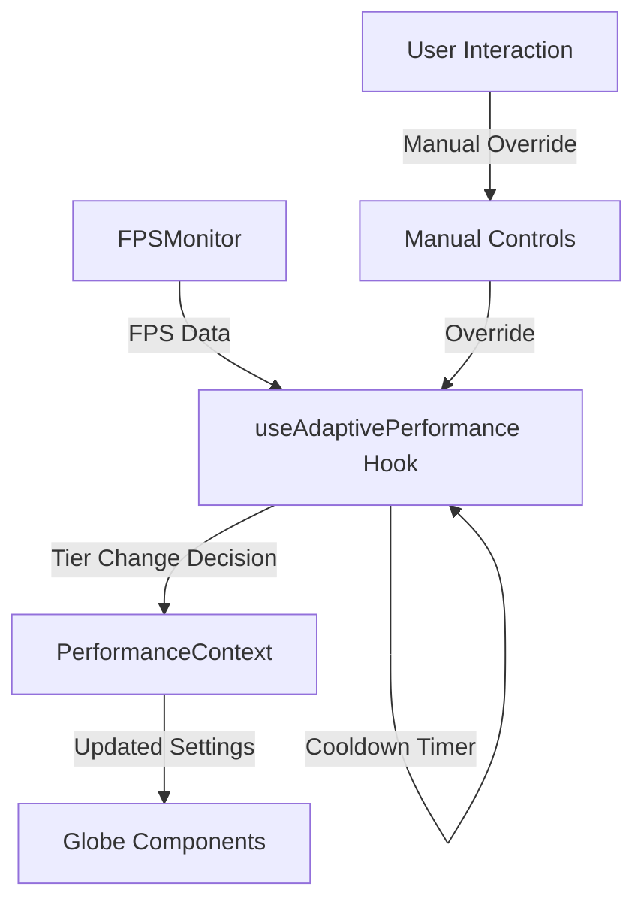

# Design Document

## Overview

The Adaptive Performance Tier system will automatically adjust the application's performance tier based on real-time FPS monitoring. The system will analyze the previous 5 seconds of FPS data to determine whether to lower the performance tier (to improve performance) or raise it (to enhance visual quality). This feature integrates seamlessly with the existing performance monitoring and management infrastructure.

## Architecture

The adaptive performance system consists of three main components:

1. **FPS Data Collection**: Leverages the existing `FPSMonitor` component to collect real-time performance data
2. **Adaptive Performance Manager**: A new hook that analyzes FPS data and makes tier adjustment decisions
3. **Performance Tier Integration**: Uses the existing `PerformanceContext` to apply tier changes

### Component Interaction Flow



## Components and Interfaces

### 1. useAdaptivePerformance Hook

**Purpose**: Central logic for analyzing FPS data and making tier adjustment decisions.

**Interface**:
```typescript
interface AdaptivePerformanceConfig {
  enabled: boolean;
  lowerThreshold: number; // 15 FPS
  upperThreshold: number; // 55 FPS
  analysisWindow: number; // 5000ms
  cooldownPeriod: number; // 10000ms
  manualOverrideDuration: number; // 30000ms
}

interface AdaptivePerformanceState {
  isEnabled: boolean;
  isInCooldown: boolean;
  isManualOverride: boolean;
  fpsHistory: number[];
  lastAdjustmentTime: number;
  lastManualOverrideTime: number;
}

interface UseAdaptivePerformanceReturn {
  config: AdaptivePerformanceConfig;
  state: AdaptivePerformanceState;
  updateConfig: (config: Partial<AdaptivePerformanceConfig>) => void;
  triggerManualOverride: () => void;
  resetCooldown: () => void;
}
```

**Key Methods**:
- `analyzeFPSData(fpsHistory: number[]): 'lower' | 'raise' | 'maintain'`
- `shouldAdjustTier(): boolean`
- `handleTierAdjustment(decision: 'lower' | 'raise'): void`

### 2. FPS Data Integration

**Modifications to FPSMonitor**:
- Add callback prop to expose FPS data to external consumers
- Maintain backward compatibility with existing usage
- Provide access to the 5-second rolling window of FPS data

**Interface Extension**:
```typescript
interface FPSMonitorProps {
  // ... existing props
  onFPSUpdate?: (fps: number, avgFps: number, fpsHistory: number[]) => void;
  enableDataExport?: boolean;
}
```

### 3. Performance Context Integration

**No changes required** - the existing `PerformanceContext` already provides:
- `setTier(tier: PerformanceTier)` method for tier changes
- Current tier state access
- Performance settings management

## Data Models

### FPS Analysis Data Structure

```typescript
interface FPSAnalysisData {
  currentFPS: number;
  averageFPS: number;
  fpsHistory: number[]; // 5-second rolling window
  timestamp: number;
  variance: number; // FPS stability indicator
}

interface TierAdjustmentDecision {
  action: 'lower' | 'raise' | 'maintain';
  reason: string;
  confidence: number; // 0-1 scale
  fromTier: PerformanceTier;
  toTier?: PerformanceTier;
}
```

### Configuration Storage

```typescript
interface AdaptivePerformanceSettings {
  enabled: boolean;
  thresholds: {
    lower: number; // 15 FPS
    upper: number; // 55 FPS
  };
  timing: {
    analysisWindow: number; // 5000ms
    cooldownPeriod: number; // 10000ms
    manualOverrideDuration: number; // 30000ms
  };
  stability: {
    minDataPoints: number; // Minimum FPS samples needed
    maxVarianceThreshold: number; // Maximum FPS variance for stable decision
  };
}
```

## Error Handling

### FPS Data Validation
- **Insufficient Data**: Skip analysis if less than 5 seconds of data available
- **Invalid FPS Values**: Filter out negative or extremely high FPS values (>200)
- **Missing Data Points**: Handle gaps in FPS data collection gracefully

### Tier Adjustment Failures
- **Invalid Tier Transition**: Log error and maintain current tier
- **Context Unavailable**: Gracefully disable adaptive performance
- **Rapid Oscillation**: Implement hysteresis to prevent tier bouncing

### Performance Impact Mitigation
- **Analysis Overhead**: Limit analysis frequency to prevent performance impact
- **Memory Management**: Maintain fixed-size FPS history buffer
- **Error Recovery**: Reset to safe state on critical errors

## Testing Strategy

### Unit Testing Focus Areas
1. **FPS Analysis Logic**: Test threshold detection and decision making
2. **Cooldown Management**: Verify timing constraints are respected
3. **Manual Override Handling**: Test override behavior and expiration
4. **Edge Cases**: Invalid data, extreme FPS values, rapid changes

### Integration Testing
1. **FPSMonitor Integration**: Verify data flow from monitor to adaptive system
2. **PerformanceContext Integration**: Test tier changes are applied correctly
3. **User Interaction**: Test manual override behavior with UI controls
4. **Performance Impact**: Measure overhead of adaptive system

### Performance Testing
1. **Low FPS Scenarios**: Verify system responds appropriately to poor performance
2. **High FPS Scenarios**: Test tier upgrades when performance allows
3. **Stability Testing**: Ensure system doesn't cause performance degradation
4. **Memory Usage**: Monitor memory consumption of FPS history tracking

## Implementation Details

### FPS Data Collection Enhancement

The existing `FPSMonitor` component will be enhanced to support data export:

```typescript
// Enhanced FPSMonitor with data export capability
const FPSMonitor: React.FC<FPSMonitorProps> = ({
  onFPSUpdate,
  enableDataExport = false,
  // ... existing props
}) => {
  // ... existing logic

  useEffect(() => {
    const measureFPS = () => {
      // ... existing FPS calculation

      // Export data if callback provided
      if (onFPSUpdate && enableDataExport) {
        onFPSUpdate(currentFps, avgFps, [...fpsHistory.current]);
      }

      // ... rest of existing logic
    };
  }, [onFPSUpdate, enableDataExport]);
};
```

### Adaptive Performance Hook Implementation

```typescript
const useAdaptivePerformance = (config: Partial<AdaptivePerformanceConfig> = {}) => {
  const { state: performanceState, setTier } = usePerformance();
  const [adaptiveState, setAdaptiveState] = useState<AdaptivePerformanceState>(initialState);
  
  const analyzeFPSData = useCallback((fpsHistory: number[]) => {
    if (fpsHistory.length < 20) return 'maintain'; // Need sufficient data
    
    const avgFPS = fpsHistory.reduce((a, b) => a + b, 0) / fpsHistory.length;
    const variance = Math.max(...fpsHistory) - Math.min(...fpsHistory);
    
    // High variance indicates instability - be conservative
    if (variance > 20) return 'maintain';
    
    if (avgFPS < config.lowerThreshold) return 'lower';
    if (avgFPS > config.upperThreshold) return 'raise';
    return 'maintain';
  }, [config]);

  const handleFPSUpdate = useCallback((fps: number, avgFps: number, fpsHistory: number[]) => {
    if (!adaptiveState.isEnabled || adaptiveState.isInCooldown || adaptiveState.isManualOverride) {
      return;
    }

    const decision = analyzeFPSData(fpsHistory);
    if (decision !== 'maintain') {
      handleTierAdjustment(decision);
    }
  }, [adaptiveState, analyzeFPSData]);

  return {
    handleFPSUpdate,
    // ... other methods
  };
};
```

### Integration with Globe Component

```typescript
const Globe: React.FC = () => {
  const adaptivePerformance = useAdaptivePerformance();
  
  return (
    <>
      <FPSMonitor
        enableDataExport={true}
        onFPSUpdate={adaptivePerformance.handleFPSUpdate}
        // ... existing props
      />
      {/* ... rest of Globe component */}
    </>
  );
};
```

## Performance Considerations

### Computational Overhead
- **FPS Analysis**: O(n) where n is history size (fixed at ~20 samples)
- **Memory Usage**: Fixed 80 bytes for FPS history (20 samples × 4 bytes)
- **Update Frequency**: Analysis only on FPS updates (every 250ms)

### Optimization Strategies
- **Debounced Analysis**: Prevent excessive tier changes
- **Hysteresis**: Different thresholds for up/down transitions
- **Predictive Adjustment**: Consider FPS trends, not just current values

### Resource Management
- **Memory Cleanup**: Clear timers and intervals on component unmount
- **Event Listener Management**: Proper cleanup of FPS data callbacks
- **State Synchronization**: Ensure consistent state across components